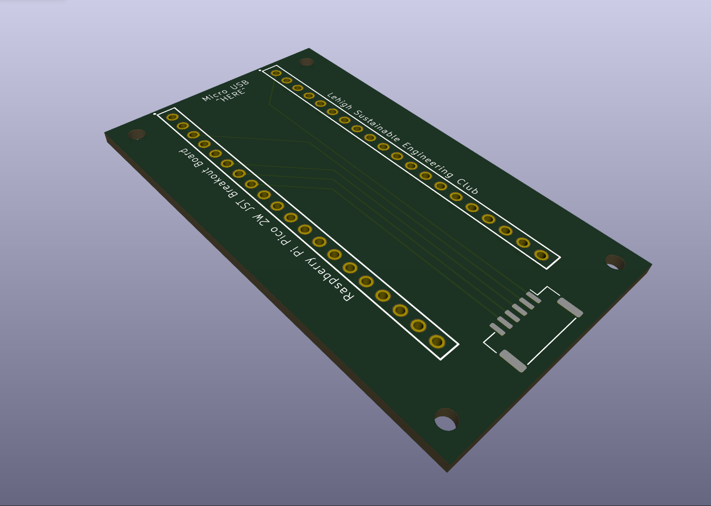
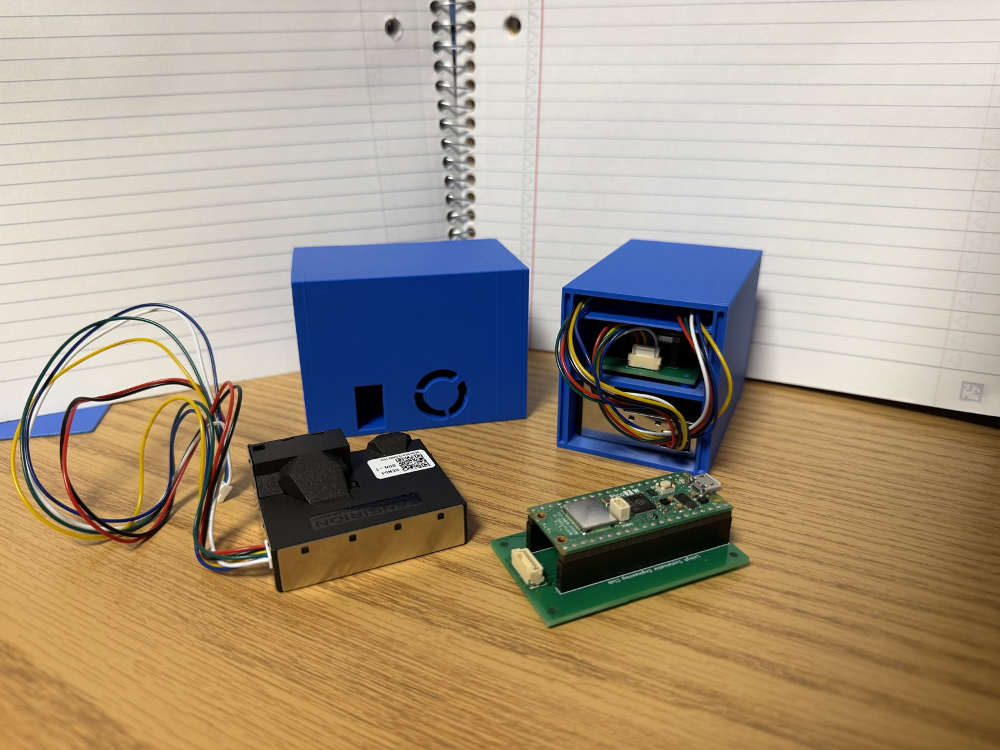
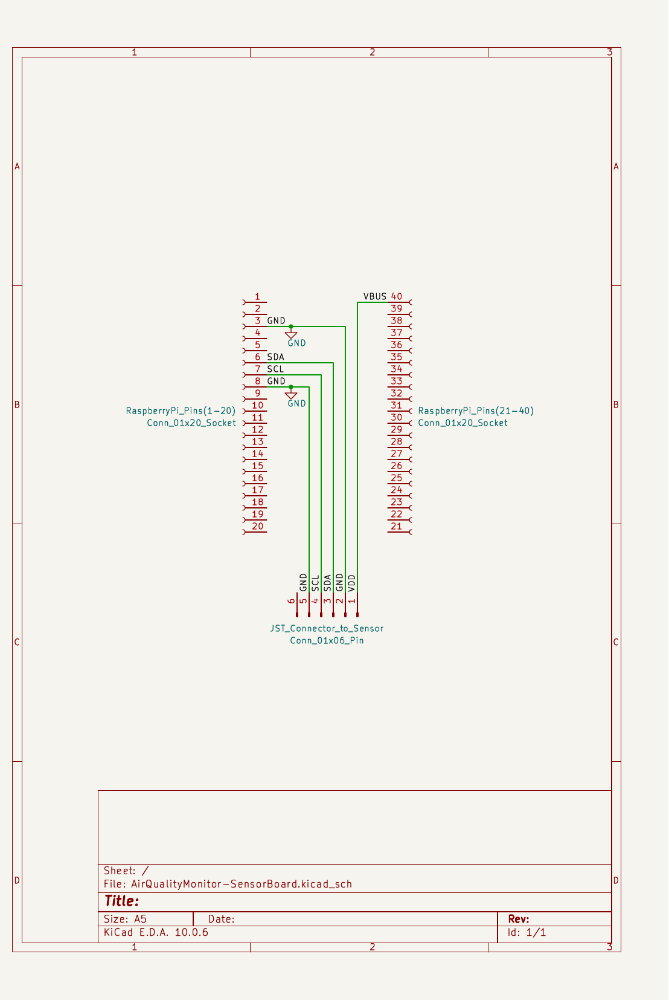
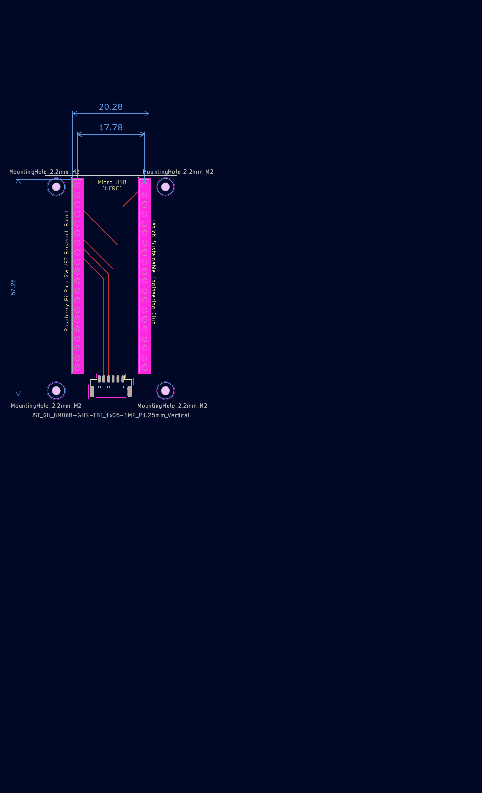

# AirQualityMonitor-SensorBoard (Pico2JSTboard)

Custom PCB for Lehigh University's Sustainable Engineering Club Air Quality Monitor project. Integrates a Raspberry Pi Pico 2 W with a Sensirion SEN54 environmental sensor for low-cost, IoT-connected indoor air quality monitoring.



## Overview

The original prototype connected the Pico 2 W to the SEN54 sensor via breadboard and loose cabling. This board replaces that setup with a compact, pluggable assembly: two socket headers accept the Pico 2 W directly, and an onboard JST connector interfaces with the SEN54 over a short cable, eliminating fragile wiring from the prototype.



## Components

| Part | Manufacturer | Notes |
|---|---|---|
| SEN54 | Sensirion | Environmental sensor node — PM, RH/T, VOC measurements |
| Raspberry Pi Pico 2 W (with headers) | Raspberry Pi | Wi-Fi–enabled microcontroller |
| 5V power supply (microUSB) | — | Powers the board via the Pico's VBUS |

## Wiring

| SEN54 Pin (JST GHR-06V-S) | Function | Pico 2 W Pin | Net |
|---|---|---|---|
| 1 | VDD | 40 (VBUS) | `VDD_5V` |
| 2 | GND | 3 (GND) | `GND` |
| 3 | SDA | 6 (GP4, I2C0 SDA) | `I2C0_SDA` |
| 4 | SCL | 7 (GP5, I2C0 SCL) | `I2C0_SCL` |
| 5 | SEL | 8 (GND) | `GND` — tied low to select I2C mode |
| 6 | NC | — | not connected |

## Schematic



## PCB Layout



## Design Notes

- Two socket headers, manually spaced to fit the Pico 2 W, replace the breadboard and loose cabling from the original prototype.
- The onboard JST connector interfaces with the SEN54 over a cable, keeping the sensor off-board for flexible mounting.
- The SEN54's SEL pin is tied to GND to select I2C communication mode (rather than UART).
- All ground connections (sensor GND, SEL, and Pico pin 3) share a single common `GND` net.

## Repository Structure

```
/hardware   KiCad project files (schematic, PCB layout, fabrication outputs)
/images     Rendered images used in this README
/firmware   Microcontroller code (in active development)
```

## Status

Board designed, fabricated, and assembled. Firmware is in active development.

## References

- [Raspberry Pi Pico 2 W Datasheet](https://datasheets.raspberrypi.com/picow/pico-2-w-datasheet.pdf)
- [Sensirion SEN5x Datasheet](https://sensirion.com/media/documents/6791EFA0/62A1F68F/Sensirion_Datasheet_Environmental_Node_SEN5x.pdf)
